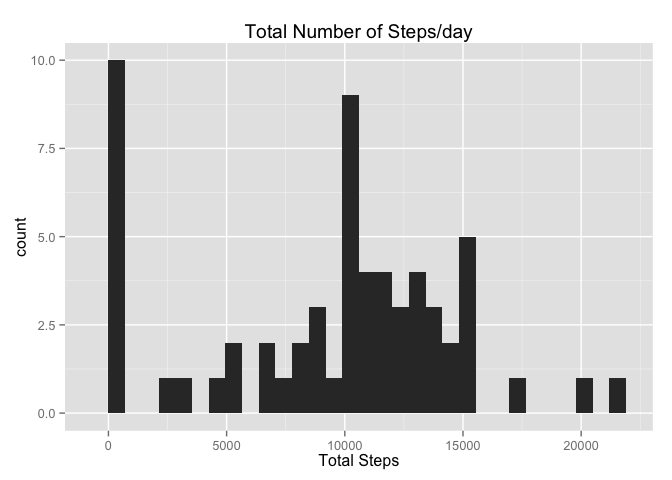
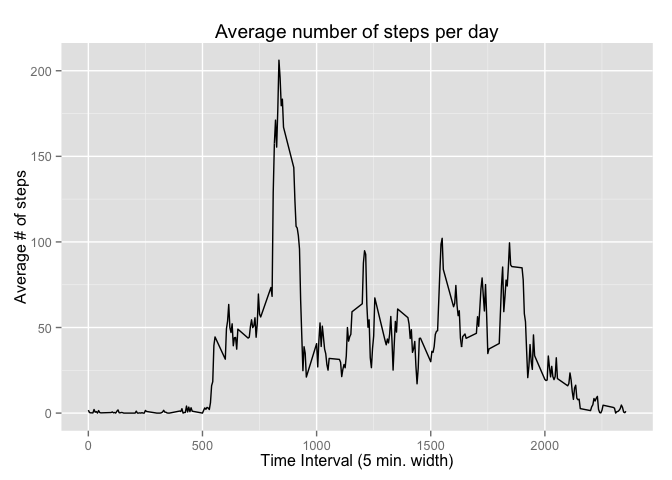
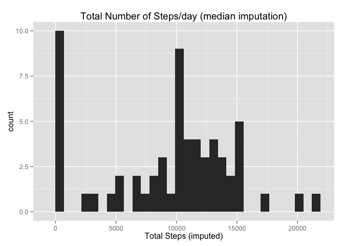
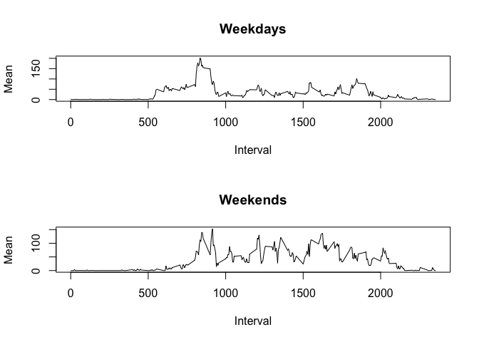

# Reproducible Research: Peer Assessment 1
William Raynor  

## Initialize R by loading required libraries

```r
library(dplyr)
```

```
## 
## Attaching package: 'dplyr'
## 
## The following object is masked from 'package:stats':
## 
##     filter
## 
## The following objects are masked from 'package:base':
## 
##     intersect, setdiff, setequal, union
```

```r
library(ggplot2)
library(lubridate)
library(Hmisc)
```

```
## Loading required package: grid
## Loading required package: lattice
## Loading required package: survival
## Loading required package: Formula
## 
## Attaching package: 'Hmisc'
## 
## The following objects are masked from 'package:dplyr':
## 
##     combine, src, summarize
## 
## The following objects are masked from 'package:base':
## 
##     format.pval, round.POSIXt, trunc.POSIXt, units
```

```r
# options(digits = 7)
```


## Loading and preprocessing the data
Starting with the supplied `activity.zip` file, unzip and read the enclosed csv file (`activity.csv`)

```r
activity <- read.csv(unz("activity.zip", "activity.csv"))
```

The resulting dataset has 17568 rows and 3 columns. One of these, labelled `date` is a factor, not a date value. Convert that factor to  POSIXct date .

```r
activity$date <- ymd(activity$date)
```

Summarize the # steps variable

```r
summary(activity$steps)
```

```
##    Min. 1st Qu.  Median    Mean 3rd Qu.    Max.    NA's 
##    0.00    0.00    0.00   37.38   12.00  806.00    2304
```


## What is mean total number of steps taken per day?
Use the `dplyr` library to compute the total number of steps per day, plot and summarize.

```r
steps <- activity %>% 
   group_by(date) %>%
   summarise(Total.Steps = sum(steps,na.rm = TRUE))
steps.summary <-summary(steps$Total.Steps)
```


```r
qplot(data=steps, Total.Steps,
      geom="histogram",
      main="Total Number of Steps/day",
      xlab="Total Steps")
```

```
## stat_bin: binwidth defaulted to range/30. Use 'binwidth = x' to adjust this.
```

 

Summary Statistics for Total Steps

```r
summary(steps$Total.Steps)
```

```
##    Min. 1st Qu.  Median    Mean 3rd Qu.    Max. 
##       0    6778   10400    9354   12810   21190
```

## What is the average daily activity pattern?

Group the data by the 5 minute intervals (`activity$interval`) and get the average number of steps per interval. Note that missing values are removed, not imputed. Plot the results as a time-series.


```r
Steps_Per_Interval <- activity %>% 
   group_by(interval) %>%
   summarise(Average.Steps = mean(steps , na.rm = TRUE))

ggplot(Steps_Per_Interval , aes(x = interval , y = Average.Steps)) +
   geom_line() +
   xlab("Time Interval (5 min. width)") +
   ylab("Average # of steps") +
   ggtitle("Average number of steps per day")
```

 


The maximum average is in the interval labelled 835.


## Imputing missing values
The previous analyses eliminated all observations with missing values for the number steps. 
In this section, we impute those missing values and compare statistics for the imputed data with the same statistics for the data with the NA's removed. There are 2304 rows with missing values among the 17568 rows in the `activity` data frame. 

We will do a simple random imputation, using the `Hmisc` `impute()` function, selecting the median value. 

```r
activity.imputed <- activity
steps.i <- impute(activity$steps)
steps.i <- as.integer(steps.i)    # impute returns an impute class vector. convert
activity.imputed$steps <- steps.i # store it on top. 
# summary(activity.imputed$steps) # summarize (not run)

steps.i <- activity.imputed %>% 
   group_by(date) %>%
   summarise(Totals = sum(steps))
i.summary <- summary(steps.i$Totals)
```

Summary of the imputed total steps per day.

```r
qplot(data = steps.i, Totals, 
      geom="histogram",
      main="Total Number of Steps/day (median imputation)",
      xlab="Total Steps (imputed)")
```

```
## stat_bin: binwidth defaulted to range/30. Use 'binwidth = x' to adjust this.
```

 

The mean and median total number of steps per day are 9354 and  1.04\times 10^{4}. After median imputation the mean and median are 9354 and 1.04\times 10^{4}. Median imputation at the interval level has no effect at the daily total level.

## Are there differences in activity patterns between weekdays and weekends?

Add a factor variable for Weekdays and Weekends to the imputed dataset, summarize 

```r
Group <- as.factor(ifelse(weekdays(activity.imputed$date) %in% c("Saturday","Sunday"),"Weekend","Weekday"))
activity2 <- cbind(activity.imputed,Group)
average_steps.i2 <- activity2 %>% 
   group_by(Group, interval) %>%
   summarise(Average.Steps = mean(steps))
WeekDays <- subset(average_steps.i2, Group == "Weekday", select=c(interval, Average.Steps))
WeekEnds <- subset(average_steps.i2, Group == "Weekend", select=c(interval, Average.Steps))
opr <-par()
par(mfrow=c(2,1))
plot(WeekDays$interval,WeekDays$Average.Steps, main="Weekdays", ylab="Mean", xlab="Interval", type="l")
plot(WeekEnds$interval,WeekEnds$Average.Steps, main="Weekends", ylab="Mean", xlab="Interval" , type="l")
```

 

```r
par(opr)
```

```
## Warning in par(opr): graphical parameter "cin" cannot be set
```

```
## Warning in par(opr): graphical parameter "cra" cannot be set
```

```
## Warning in par(opr): graphical parameter "csi" cannot be set
```

```
## Warning in par(opr): graphical parameter "cxy" cannot be set
```

```
## Warning in par(opr): graphical parameter "din" cannot be set
```

```
## Warning in par(opr): graphical parameter "page" cannot be set
```

```r
# this code throws an error
# ggplot(average_steps.i2 , aes(x=date,y=Average.Steps)) + 
#    geom_line() +
#    facet_wrap(~Group , nrow=2)
```


